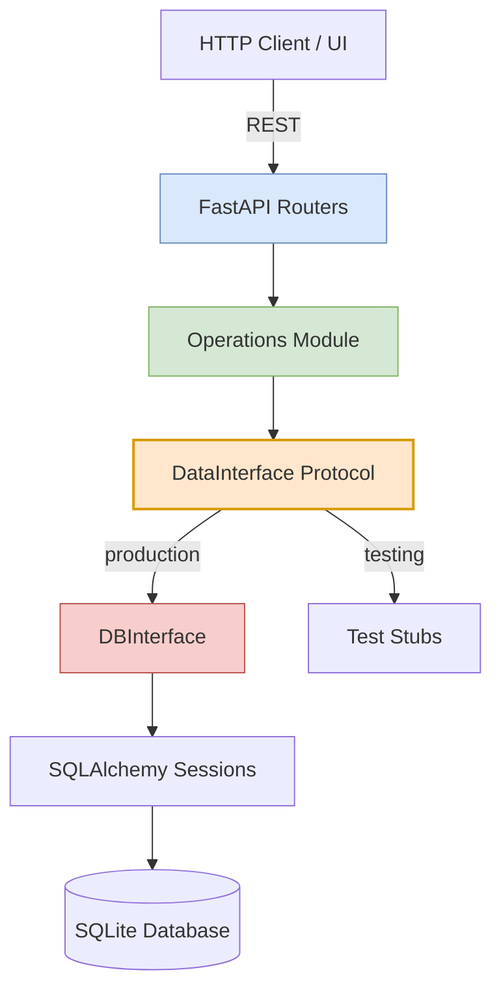
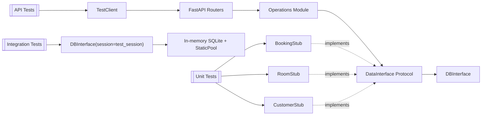
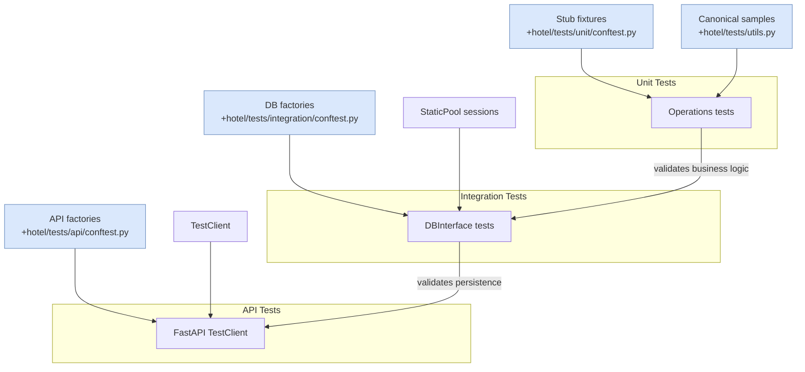

# Testable Hotel Booking Application

[](https://www.python.org/)
[](https://fastapi.tiangolo.com/)
[]()
[]()

## 🎯 Project Purpose

This project demonstrates how **architectural decisions enable comprehensive test automation**. It showcases:

- **Protocol-based abstraction** for dependency injection
- **Three-layer architecture** (API → Operations → Database)
- **Three-level testing strategy** (Unit → Integration → API)
- **98% test coverage** with fast, isolated tests
- **Clean separation of concerns** through design patterns

Built as a portfolio piece for **Staff Test Automation Engineer** roles, emphasizing how **testability must be designed into the architecture from day one**.

### Portfolio Highlights

- ✅ **86 automated tests** across three layers with pytest markers for selective execution
- ✅ **98% statement coverage** (100% on operations + routers) proven via `pytest-cov`
- ✅ **Documented DI + Protocol contracts** enabling fast swap between DB interface and stubs
- ✅ **Canonical data builders** (`booking_sample`, `customer_sample`, `room_sample`) that eliminate magic literals
- ✅ **Comprehensive README + DOCSTRING standards** to communicate strategy to leadership and auditors

---

## Architecture Overview

### High-Level Architecture

#### Application Runtime



#### Test Harness Mapping




### Layer Separation

The application is structured in **three distinct layers**, each testable in isolation:

| Layer | Responsibility | Dependencies | Testability |
|-------|---------------|--------------|-------------|
| **Routers** (API) | HTTP handling, routing | Operations, Models | API tests with TestClient |
| **Operations** (Business Logic) | Business rules, calculations | DataInterface (abstraction) | Unit tests with stubs |
| **Database** (Persistence) | CRUD operations, transactions | SQLAlchemy, Models | Integration tests with in-memory DB |

---

## Design Patterns & Abstractions

### 1. Protocol Pattern (Structural Typing)

Python's `Protocol` enables **compile-time duck typing** for interface contracts:

```python
# hotel/operations/interface.py
from typing import Protocol, List, Any

DataObject = dict[str, Any]

class DataInterface(Protocol):
    """
    Protocol defining the contract for data access.
    
    Any class implementing these methods can be used interchangeably,
    enabling dependency injection and test doubles.
    """
    
    def read_by_id(self, id: int) -> DataObject: ...
    def read_all(self) -> List[DataObject]: ...
    def create(self, data: DataObject) -> DataObject: ...
    def update(self, id: int, data: DataObject) -> DataObject: ...
    def delete(self, id: int) -> DataObject: ...
```

Full protocol plus type aliases live in [hotel/operations/interface.py](hotel/operations/interface.py) so reviewers can jump straight to the concrete implementation.

**Why Protocol over ABC?**
- ✅ No explicit inheritance required (structural subtyping)
- ✅ Duck typing with type checking support
- ✅ More flexible for test doubles
- ✅ Better IDE autocomplete

### 2. Repository Pattern

`DBInterface` encapsulates all database access logic:

```python
# hotel/db/db_interface.py
from typing import Any, List, Optional
from sqlalchemy.orm import Session
from hotel.db.models import Base, to_dict

DataObject = dict[str, Any]

class DBInterface:
    """
    Repository pattern implementation for database operations.
    
    KEY FEATURES:
    - Generic: Works with any SQLAlchemy model
    - Session injection: Supports test sessions
    - Encapsulation: All SQL hidden from business logic
    """
    
    def __init__(self, db_class: type[Base], session: Optional[Session] = None):
        """
        Args:
            db_class: SQLAlchemy model (DBCustomer, DBRoom, DBBooking)
            session: Optional session for testing (None = production)
        """
        self.db_class = db_class
        self._session = session

    def _get_session(self) -> Session:
        """Get test session or production session."""
        return self._session if self._session else engine.DBSession()

    def read_all(self) -> List[DataObject]:
        session = self._get_session()
        results = session.query(self.db_class).all()
        return [to_dict(result) for result in results]

    def create(self, data: DataObject) -> DataObject:
        session = self._get_session()
        result = self.db_class(**data)
        session.add(result)
        session.commit()
        return to_dict(result)
    
    # ... update, delete, read_by_id
```

Repository implementation details are centralized in [hotel/db/db_interface.py](hotel/db/db_interface.py); the snippet above is exactly what powers every router and test fixture.

**Benefits:**
- Single source of truth for CRUD operations
- Database technology agnostic (easy to swap SQLite → PostgreSQL)
- Session injection enables test isolation
- No SQL leaking into business logic

### 3. Dependency Injection Pattern

Operations layer receives dependencies through parameters, not imports:

```python
# hotel/operations/bookings.py
from hotel.operations.interface import DataInterface, DataObject

def create_booking(
    data: BookingCreateData,
    booking_interface: DataInterface,  # ← Injected
    room_interface: DataInterface,     # ← Injected
) -> DataObject:
    """
    Business logic for booking creation.
    
    INJECTION PATTERN:
    - Interfaces passed as parameters
    - No direct database coupling
    - Can inject real DB or test stubs
    """
    # Get room details to calculate price
    room = room_interface.read_by_id(data.room_id)
    
    # Business logic: calculate price
    days = (data.to_date - data.from_date).days
    if days <= 0:
        raise InvalidDateError("Invalid booking dates")
    
    # Prepare booking with calculated price
    booking_dict = data.model_dump()
    booking_dict["price"] = room["price"] * days
    
    return booking_interface.create(booking_dict)
```

**Injection happens at the router layer:**

```python
# hotel/routers/bookings.py (Production)
@router.post("/booking")
def api_create_booking(booking: BookingCreateData):
    # Inject REAL database interfaces
    booking_interface = DBInterface(DBBooking)
    room_interface = DBInterface(DBRoom)
    
    return create_booking(booking, booking_interface, room_interface)
```

**Or at the test layer:**

```python
# hotel/tests/unit/test_bookings.py (Testing)
from hotel.tests.utils import booking_sample

def test_read_booking_by_id():
    # Inject TEST STUBS instead
    booking_stub = BookingStub()
    
    result = read_booking_by_id(1, booking_stub)
    expected = booking_sample()
    
    for field, value in expected.items():
        assert result[field] == value
```

---

## Testing Strategy

### Three-Level Testing Pyramid

```
           ╱╲
          ╱  ╲         API Tests (25)
         ╱____╲        - Full HTTP stack
        ╱      ╲       - Real routing
       ╱        ╲      - Business logic
      ╱__________╲     - Real database
     ╱            ╲
    ╱  Integration ╲   Integration Tests (46)
   ╱    (46 tests)  ╲  - DBInterface + real DB
  ╱__________________╲ - No HTTP layer
 ╱                    ╲
╱   Unit Tests (15)    ╲ Unit Tests (15)
╲______________________╱ - Stubs only
                          - Pure logic
```

### Fixture-Driven Data Flow



This extra component highlights how each suite receives purpose-built fixtures, underscoring the SDET-focused discipline around data ownership and isolation.

### 1. Unit Tests (Isolation Layer)

**Purpose**: Test business logic without any external dependencies

```python
# hotel/tests/unit/test_bookings.py
"""
Unit Tests for Booking Operations

TESTING APPROACH:
- Tests business logic in isolation using stub interfaces
- No database or external dependencies
- Fast execution, focused on operation layer logic

ARCHITECTURE:
Operations (business logic) → Stub Interface (fake data)
"""

from hotel.tests.utils import assert_booking_valid, booking_sample

@pytest.mark.unit
class TestBookingOperations:

    def test_read_booking_by_id(self, booking_stub):
        """Validate booking lookup returns canonical sample."""

        result = read_booking_by_id(1, booking_stub)

        assert_booking_valid(result)
        expected = booking_sample()
        for field, value in expected.items():
            assert result[field] == value

    def test_create_booking_calculates_price(
        self,
        booking_stub,
        room_stub,
        sample_booking_data
    ):
        """Verify create_booking calculates price using injected room."""

        result = create_booking(sample_booking_data, booking_stub, room_stub)

        assert_booking_valid(result)
        assert result["price"] == 300  # 3 nights × 100
```

These examples come directly from [hotel/tests/unit/test_bookings.py](hotel/tests/unit/test_bookings.py), making it easy to trace assertions back to their source.

**Stub Implementation** (Manual test doubles):

```python
# hotel/tests/stubs/booking_stub.py
from hotel.db.db_interface import DataObject
from hotel.tests.stubs.stub_interface import DataStubInterface

class BookingStub(DataStubInterface):
    """
    Test double providing configurable booking data.
    
    PATTERN: Stub (not mock!)
    - Returns predictable data
    - Allows per-test overrides via constructor
    - Keeps implementation intentionally simple
    """

    def __init__(self, bookings: list[DataObject] | None = None) -> None:
        self._bookings = bookings or [
            {
                "id": 1,
                "from_date": "2025-12-20",
                "to_date": "2025-12-22",
                "price": 200,
                "customer_id": 1,
                "room_id": 1,
            },
            {
                "id": 2,
                "from_date": "2025-12-23",
                "to_date": "2025-12-25",
                "price": 300,
                "customer_id": 2,
                "room_id": 2,
            },
        ]

    def read_by_id(self, id: int) -> DataObject:
        booking = next((b for b in self._bookings if b["id"] == id), dict(self._bookings[0]))
        booking["id"] = id  # Preserve requested id for clarity
        return booking

    def read_all(self) -> list[DataObject]:
        return [dict(b) for b in self._bookings]

    def create(self, data: DataObject) -> DataObject:
        booking = dict(data)
        booking["id"] = 999  # Stub ID
        return booking
```

The full stub (and its configurable constructor) lives in [hotel/tests/stubs/booking_stub.py](hotel/tests/stubs/booking_stub.py).

**Shared Sample Builders** (keeps assertions clean and expressive):

```python
# hotel/tests/utils.py
from typing import Any

def booking_sample(overrides: dict[str, Any] | None = None) -> dict[str, Any]:
    sample = {
        "id": 1,
        "from_date": "2025-12-20",
        "to_date": "2025-12-22",
        "price": 200,
        "customer_id": 1,
        "room_id": 1,
    }
    if overrides:
        sample.update(overrides)
    return sample
```

**Why Stubs Over Mocks?**
- ✅ Simpler: No mock framework needed
- ✅ Faster: No setup/verification overhead
- ✅ Readable: Explicit test data
- ✅ Maintainable: Easy to understand
- ✅ Configurable: Constructor overrides let each test tailor data without rewriting doubles

### 2. Integration Tests (Database Layer)

**Purpose**: Test database operations with real SQLAlchemy + in-memory SQLite

```python
# hotel/tests/integration/test_booking_db.py
"""
Integration tests for booking database operations.

TESTING APPROACH:
- Tests interact with REAL database (in-memory SQLite)
- No mocks or stubs - testing actual DB layer
- Verifies database constraints, relationships, and CRUD operations

ARCHITECTURE:
DBInterface → SQLAlchemy → In-Memory SQLite
"""

@pytest.mark.integration
@pytest.mark.database
class TestBookingDatabaseOperations:
    
    def test_create_booking_persists_to_database(
        self,
        booking_db_interface,  # ← Real DBInterface
        customer_factory,
        room_factory,
        test_db_session       # ← Real SQLAlchemy session
    ):
        """Test that creating a booking persists data to database."""
        # Arrange - Create dependencies in DB
        customer = customer_factory(first_name="Alice")
        room = room_factory(number="101", price=100)
        
        booking_data = {
            "customer_id": customer.id,
            "room_id": room.id,
            "from_date": date(2025, 12, 25),
            "to_date": date(2025, 12, 28),
            "price": 300
        }
        
        # Act - Use real DBInterface
        result = booking_db_interface.create(booking_data)
        
        # Assert - Verify persistence
        saved = test_db_session.query(DBBooking).filter_by(id=result["id"]).first()
        assert saved is not None
        assert saved.price == 300
```

**Test Database Pattern** with **StaticPool**:

```python
# hotel/tests/integration/conftest.py
@pytest.fixture(scope="function")
def test_db_engine():
    """
    Provide isolated in-memory SQLite database engine.
    
    CRITICAL: StaticPool ensures all connections share the same
    in-memory database. Without this, each connection gets a
    different database instance.
    """
    engine = create_engine(
        "sqlite:///:memory:",
        connect_args={"check_same_thread": False},
        poolclass=StaticPool  # ← Essential for in-memory testing!
    )
    
    Base.metadata.create_all(bind=engine)
    yield engine
    
    Base.metadata.drop_all(bind=engine)
    engine.dispose()
```

**Factory Pattern** for test data:

```python
@pytest.fixture
def customer_factory(test_db_session):
    """Factory fixture for creating test customers."""
    def _create_customer(**kwargs):
        defaults = {
            "first_name": "John",
            "last_name": "Doe",
            "email_address": "john@example.com"
        }
        defaults.update(kwargs)
        
        customer = DBCustomer(**defaults)
        test_db_session.add(customer)
        test_db_session.commit()
        return customer
    
    return _create_customer
```

### 3. API Tests (Full Stack Integration)

**Purpose**: Test complete HTTP → Router → Operations → Database flow

```python
# hotel/tests/api/test_booking_api.py
"""
API Integration Tests for Booking Endpoints

TESTING APPROACH:
- Tests complete booking workflow through HTTP API
- Validates integration of customer, room, and booking entities
- Tests business logic through API layer (price calculation)

ARCHITECTURE:
HTTP → Router → Operations (business logic) → DBInterface → Test DB

This is the HIGHEST level of integration testing.
"""

@pytest.mark.api
@pytest.mark.integration
class TestBookingAPIEndpoints:
    
    def test_create_booking_calculates_price_correctly(
        self,
        api_client,      # ← FastAPI TestClient
        api_customer,    # ← Factory creating via API
        api_room
    ):
        """Test that booking price is calculated correctly through API."""
        # Arrange - Create dependencies via API
        customer = api_customer(first_name="Alice")
        room = api_room(number="101", price=100)
        
        # Act - POST request to create booking
        response = api_client.post("/booking", json={
            "customer_id": customer["id"],
            "room_id": room["id"],
            "from_date": "2025-12-25",
            "to_date": "2025-12-28"  # 3 days
        })
        
        # Assert - HTTP and business logic
        assert response.status_code == 200
        assert response.json()["price"] == 300  # 3 days × $100
```

**TestClient Setup** with dependency injection:

```python
# hotel/tests/api/conftest.py
@pytest.fixture(scope="function")
def api_client(test_api_engine, test_api_session):
    """
    Provide FastAPI TestClient with test database.
    
    PATTERN: Override production dependencies
    - Same FastAPI app as production
    - Different database (in-memory test DB)
    """
    app = FastAPI()
    
    # Include routers (same as production)
    app.include_router(bookings.router)
    app.include_router(customers.router)
    app.include_router(rooms.router)
    
    # Override global engine for testing
    engine_module.DBSession = sessionmaker(bind=test_api_engine)
    
    client = TestClient(app)
    yield client
    
    # Cleanup
    test_api_session.rollback()
```

---

## Test Coverage & Metrics

### Coverage by Layer

```bash
$ pytest hotel/tests/ --cov=hotel --cov-report=term-missing

Name                              Stmts   Miss  Cover   Missing
---------------------------------------------------------------
hotel/db/db_interface.py             23      0   100%
hotel/db/engine.py                   10      1    90%   15
hotel/db/models.py                   19      0   100%
hotel/operations/bookings.py         21      0   100%
hotel/operations/customers.py        15      0   100%
hotel/operations/rooms.py             8      0   100%
hotel/routers/bookings.py            17      0   100%
hotel/routers/customers.py           21      0   100%
hotel/routers/rooms.py               14      0   100%
---------------------------------------------------------------
TOTAL                               148      1    98%
```

### Test Distribution

| Test Level | Count | Focus Area | Execution Time |
|-----------|-------|------------|----------------|
| **Unit** | 15 | Business logic isolation | <0.1s |
| **Integration** | 46 | Database operations | ~0.3s |
| **API** | 25 | Full HTTP stack | ~0.4s |
| **Total** | **86** | Complete coverage | **~0.7s** |

### Pytest Markers

```python
# Run only unit tests (fastest)
pytest -m unit

# Run only database integration tests
pytest -m "integration and database"

# Run only API tests
pytest -m api

# Run critical path tests
pytest -m critical

# Run all booking-related tests
pytest -m booking
```

**Marker definitions** in `pytest.ini`:

```ini
[pytest]
markers =
    unit: Unit tests (stubs only, no DB)
    integration: Integration tests (real DB)
    api: API integration tests (full stack)
    database: Tests requiring database
    smoke: Critical path smoke tests
    critical: Critical business functionality
    booking: Booking-related tests
    customer: Customer-related tests
    room: Room-related tests
```

## Test Execution Strategy

- **Local dev loop**: `pytest -m "unit or integration" --maxfail=1 --durations=5` runs in roughly 0.4s, covering all business logic and database contracts without spinning up HTTP.
- **Pull-request gate**: CI executes `pytest -m "unit or integration or smoke"` so every merge validates fast suites plus smoke API flows that finish in <0.2s; failures stop the pipeline immediately thanks to `--maxfail=1`.
- **Nightly full-stack**: A scheduled workflow runs `pytest -m "api or booking"` (~0.4s) to exercise end-to-end booking flows, demonstrating how markers (`smoke`, `api`, `booking`) encode operational intent rather than just directories.
- **Targeted investigations**: Engineers can run `pytest -m "booking and integration"` to validate only database-facing booking scenarios after schema changes, keeping feedback tight.

## Quality Gates & Linting Hooks

Every push passes through predictable gates: locally, `pre-commit` runs `ruff check` and `black --check` to catch regressions before code review; remotely, CI executes the same commands plus targeted marker suites so formatting or lint drift can never ship. The reusable workflow below keeps the entire team honest:

```yaml
name: quality
on:
    pull_request:
        branches: [main]
    push:
        branches: [main]
jobs:
    tests-and-lint:
        runs-on: ubuntu-latest
        steps:
            - uses: actions/checkout@v4
            - uses: actions/setup-python@v5
                with:
                    python-version: "3.11"
            - run: pip install -r requirements.txt
            - run: pytest -m "unit or integration or smoke" --maxfail=1 --durations=10
            - run: pytest -m "api and smoke" --maxfail=1
            - run: ruff check hotel
            - run: black --check hotel
```

## Data Helpers Reference

| Helper | Purpose | Location | Typical Usage |
|--------|---------|----------|----------------|
| `booking_sample`, `customer_sample`, `room_sample` | Canonical assertions that eliminate magic literals in unit tests. | [hotel/tests/utils.py](hotel/tests/utils.py) | Import into unit tests such as [hotel/tests/unit/test_bookings.py](hotel/tests/unit/test_bookings.py) to validate full payloads quickly. |
| `build_*_dict` helpers | Lightweight builders for bespoke payloads when canonical samples are not enough. | [hotel/tests/utils.py](hotel/tests/utils.py) | Compose unique edge-case dictionaries without rewriting boilerplate fields. |
| Stub fixtures (`booking_stub`, `room_stub`, `customer_stub`) + sample data fixtures | Provide isolated `DataInterface` implementations and DTO builders for operations tests. | [hotel/tests/unit/conftest.py](hotel/tests/unit/conftest.py) | Inject into operations tests to keep them hermetic and dependency-free. |
| Factory fixtures (`customer_factory`, `room_factory`, `booking_factory`) | Persist related entities into the integration database with transactional rollback. | [hotel/tests/integration/conftest.py](hotel/tests/integration/conftest.py) | Create realistic relational graphs before calling [hotel/db/db_interface.py](hotel/db/db_interface.py) methods. |
| API factories (`api_customer`, `api_room`, `api_booking`) | Stand up data through real HTTP endpoints for end-to-end tests. | [hotel/tests/api/conftest.py](hotel/tests/api/conftest.py) | Seed API suites so each test owns its data and mirrors production calls. |

These helpers are intentionally layered—from pure dict builders to real API factories—so every test picks the lightest-weight construct that still tells the story of the behavior under test.

---

## Key Technical Decisions

### 1. Protocol vs ABC

**Chosen**: `Protocol` (PEP 544 - Structural Subtyping)

```python
# ✅ Protocol - Structural typing (duck typing with type checking)
class DataInterface(Protocol):
    def read_all(self) -> List[DataObject]: ...

# Stub doesn't need inheritance
class BookingStub:  # ← No inheritance!
    def read_all(self) -> List[DataObject]:
        return [{"id": 1}]

# Type checker validates compatibility
def get_bookings(interface: DataInterface):
    return interface.read_all()

get_bookings(BookingStub())  # ✅ Valid
```

vs.

```python
# ❌ ABC - Nominal typing (requires explicit inheritance)
class DataInterface(ABC):
    @abstractmethod
    def read_all(self) -> List[DataObject]: ...

# Stub MUST inherit
class BookingStub(DataInterface):  # ← Forced inheritance
    def read_all(self) -> List[DataObject]:
        return [{"id": 1}]
```

**Why Protocol wins:**
- More Pythonic (duck typing philosophy)
- No inheritance coupling
- Better for test doubles
- IDE support for autocomplete

### 2. Stubs vs Mocks

**Chosen**: Manual Stubs

```python
# ✅ Stub - Simple, explicit
class RoomStub(DataStubInterface):
    def read_by_id(self, id: int) -> DataObject:
        return {"id": id, "price": 100}

# Test is readable
result = create_booking(data, booking_stub, room_stub)
assert result["price"] == 200
```

vs.

```python
# ❌ Mock - Complex, implicit
room_mock = Mock(spec=DataInterface)
room_mock.read_by_id.return_value = {"id": 1, "price": 100}

# Test has setup overhead
result = create_booking(data, booking_mock, room_mock)
room_mock.read_by_id.assert_called_once_with(1)
assert result["price"] == 200
```

**Why Stubs win:**
- No framework dependency (unittest.mock)
- Explicit test data
- Simpler debugging
- Better for state verification vs behavior verification

### 3. Session Injection Pattern

**Problem**: How to use production DB in routers, test DB in tests?

**Solution**: Optional session parameter in `DBInterface`

```python
class DBInterface:
    def __init__(self, db_class: type[Base], session: Optional[Session] = None):
        self._session = session

    def _get_session(self) -> Session:
        # Test session if provided, else production
        return self._session if self._session else engine.DBSession()
```

**Production** (no session parameter):
```python
# Routers create interface without session
booking_interface = DBInterface(DBBooking)  # ← Uses production DB
```

**Testing** (inject test session):
```python
# Tests inject test session
booking_interface = DBInterface(DBBooking, session=test_db_session)
```

### 4. StaticPool for In-Memory Testing

**Problem**: Each SQLAlchemy connection to `:memory:` creates a new database

```python
# ❌ Without StaticPool - Different databases!
engine = create_engine("sqlite:///:memory:")
conn1 = engine.connect()  # Database A
conn2 = engine.connect()  # Database B (empty!)
```

**Solution**: Use `StaticPool` to share connections

```python
# ✅ With StaticPool - Shared database!
from sqlalchemy.pool import StaticPool

engine = create_engine(
    "sqlite:///:memory:",
    poolclass=StaticPool  # ← All connections use same DB
)
conn1 = engine.connect()  # Database A
conn2 = engine.connect()  # Database A (same!)
```

## Technology Stack

| Layer | Technology | Version | Purpose |
|-------|-----------|---------|---------|
| **Web Framework** | FastAPI | 0.127.0 | HTTP routing, OpenAPI |
| **ASGI Server** | Uvicorn | 0.40.0 | Production server |
| **ORM** | SQLAlchemy | 2.0.45 | Database abstraction |
| **Database** | SQLite | 3.x | Persistence (file-based) |
| **Validation** | Pydantic | 2.x | Data models |
| **Testing** | pytest | 8.3.4 | Test framework |
| **Coverage** | pytest-cov | 7.0.0 | Coverage reporting |
| **HTTP Client** | httpx | 0.28.1 | API testing |
| **Linting** | Ruff | 0.14.10 | Code quality |
| **Formatting** | Black | 25.12.0 | Code formatting |

---

## Running the Application

### Installation

```bash
# Clone repository
git clone https://github.com/iklymchuk/test-app.git
cd test-app

# Create virtual environment
python -m venv venv
source venv/bin/activate  # On Windows: venv\Scripts\activate

# Install dependencies
pip install -r requirements.txt
```

### Run Application

```bash
# Start FastAPI server
uvicorn main:app --reload

# Access API
open http://127.0.0.1:8000

# OpenAPI docs
open http://127.0.0.1:8000/docs
```

### Run Tests

```bash
# All tests
pytest hotel/tests/ -v

# Unit tests only (fastest)
pytest hotel/tests/unit/ -v

# Integration tests
pytest hotel/tests/integration/ -v

# API tests
pytest hotel/tests/api/ -v

# With coverage
pytest hotel/tests/ --cov=hotel --cov-report=html

# Specific markers
pytest -m unit              # Unit tests
pytest -m "integration"     # Integration tests
pytest -m "api"             # API tests
pytest -m "critical"        # Critical path only
```

### Code Quality

```bash
# Linting
ruff check hotel/

# Formatting
black hotel/

# Type checking (if mypy installed)
mypy hotel/
```

---

## Project Structure

```
test-app/
├── hotel/
│   ├── db/                      # Database Layer
│   │   ├── db_interface.py      # Repository pattern implementation
│   │   ├── engine.py            # SQLAlchemy engine configuration
│   │   └── models.py            # SQLAlchemy models (DBCustomer, DBRoom, DBBooking)
│   │
│   ├── operations/              # Business Logic Layer
│   │   ├── interface.py         # Protocol definition (DataInterface)
│   │   ├── bookings.py          # Booking business logic
│   │   ├── customers.py         # Customer business logic
│   │   └── rooms.py             # Room business logic
│   │
│   ├── routers/                 # API Layer
│   │   ├── bookings.py          # Booking endpoints
│   │   ├── customers.py         # Customer endpoints
│   │   └── rooms.py             # Room endpoints
│   │
│   └── tests/                   # Test Suite
│       ├── unit/                # Unit Tests (15 tests)
│       │   ├── conftest.py      # Stub fixtures
│       │   ├── test_bookings.py
│       │   ├── test_customers.py
│       │   └── test_rooms.py
│       │
│       ├── integration/         # Integration Tests (46 tests)
│       │   ├── conftest.py      # DB fixtures, factories
│       │   ├── test_booking_db.py
│       │   ├── test_customer_db.py
│       │   └── test_room_db.py
│       │
│       ├── api/                 # API Tests (25 tests)
│       │   ├── conftest.py      # API client fixtures
│       │   ├── test_booking_api.py
│       │   ├── test_customer_api.py
│       │   └── test_room_api.py
│       │
│       ├── stubs/               # Test Doubles
│       │   ├── stub_interface.py  # Base ABC for stubs
│       │   ├── booking_stub.py
│       │   ├── customer_stub.py
│       │   └── room_stub.py
│       │
│       └── utils.py             # Test utilities
│
├── main.py                      # FastAPI application entry point
├── requirements.txt             # Python dependencies
├── pytest.ini                   # Pytest configuration
├── .coveragerc                  # Coverage configuration
└── hotel_snap.db               # SQLite database (auto-created)
```

---

## Key Learnings & Best Practices

### 1. Design for Testability from Day One

**Bad** (tightly coupled):
```python
def create_booking(data):
    session = engine.DBSession()  # ← Hard dependency
    booking = DBBooking(**data)
    session.add(booking)
    session.commit()
```

**Good** (dependency injection):
```python
def create_booking(data, booking_interface: DataInterface):
    return booking_interface.create(data)  # ← Injected dependency
```

### 2. Layer Boundaries Are Non-Negotiable

- ❌ **Never** import database from operations layer
- ❌ **Never** put business logic in routers
- ✅ **Always** pass dependencies as parameters
- ✅ **Always** use abstractions (Protocol) at boundaries

### 3. Test Doubles Should Be Simple

```python
# ✅ Good - Simple stub
class RoomStub:
    def read_by_id(self, id: int):
        return {"id": id, "price": 100}

# ❌ Bad - Overcomplicated mock
room_mock = MagicMock()
room_mock.read_by_id.return_value = {"id": 1, "price": 100}
room_mock.read_by_id.side_effect = lambda x: {"id": x, "price": 100}
```

### 4. Test Isolation Is Critical

Every test must:
- ✅ Start with clean state (fresh DB)
- ✅ Not depend on execution order
- ✅ Clean up after itself
- ✅ Be runnable in parallel

### 5. Coverage ≠ Quality

- 98% coverage doesn't mean bug-free
- Focus on **critical paths** and **edge cases**
- Test **behavior**, not implementation
- Use markers to identify critical tests

---

## Testing Principles

### Test Pyramid

- **Many** unit tests (fast, isolated)
- **Some** integration tests (medium speed, real DB)
- **Few** API tests (slower, full stack)

### Test Independence

- Each test creates its own data
- No shared state between tests
- Fixtures provide fresh instances

### Arrange-Act-Assert Pattern

```python
def test_example():
    # Arrange - Set up test data
    customer = customer_factory(first_name="Alice")
    
    # Act - Execute the operation
    result = read_customer_by_id(customer.id, interface)
    
    # Assert - Verify expectations
    assert result["first_name"] == "Alice"
```

### Test Naming Convention

```python
# Pattern: test_<method>_<scenario>_<expected>
test_create_booking_with_valid_data_returns_booking()
test_create_booking_with_invalid_dates_raises_error()
test_read_customer_by_id_not_exists_returns_none()
```

---

## Related Patterns & Concepts

- **SOLID Principles**: Dependency Inversion, Single Responsibility
- **Hexagonal Architecture** (Ports & Adapters): DataInterface is a port
- **Clean Architecture**: Dependency rule (inner layers don't know outer)
- **Test Doubles**: Stubs, Mocks, Fakes, Dummies, Spies
- **Factory Pattern**: Test data builders (customer_factory, room_factory)
- **Repository Pattern**: DBInterface encapsulates data access

---

## License

MIT License - Feel free to use this as a reference for your own projects.

---

## Acknowledgments

Built to showcase how **architecture enables testing**, not as an afterthought but as a **first-class design consideration**.

> "Any fool can write code that a computer can understand. Good programmers write code that humans can understand."  
> — Martin Fowler

> "Testing shows the presence, not the absence of bugs."  
> — Edsger W. Dijkstra


<h4 style="text-align:center;">Built with ❤️ by Ivan Klymchuk</h4>